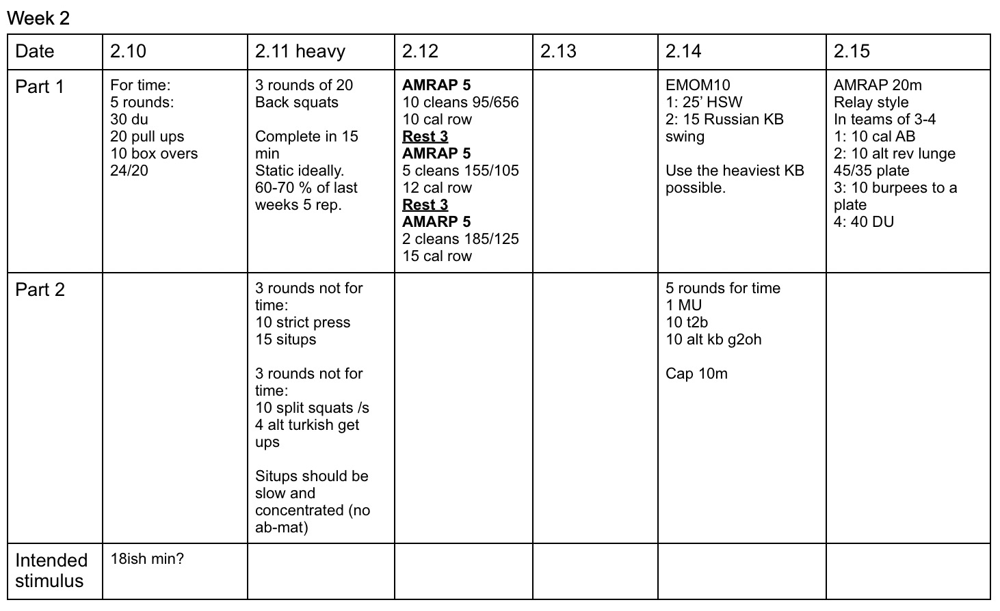

*  ### 11/11/19
"McGhee" 
It's been a long time since I've done this one.  Like ACF long. As always, focus on non-fail push ups.
* ### 11/12/19
    Heavy day. Watch "bouncing" on bent over rows. 
* ### 11/13/19
    Every 3 minutes row 500m and then AMRAP situps.  Score total situps.
* ### 11/15/19
    Think "DT" kb style with russian KB swings.  If time allows, focus on the "strict" part of the t2b. 
* ### 11/16/19
    Team size can be whatever works.  3+ would be ideal, or there's no rest. 
