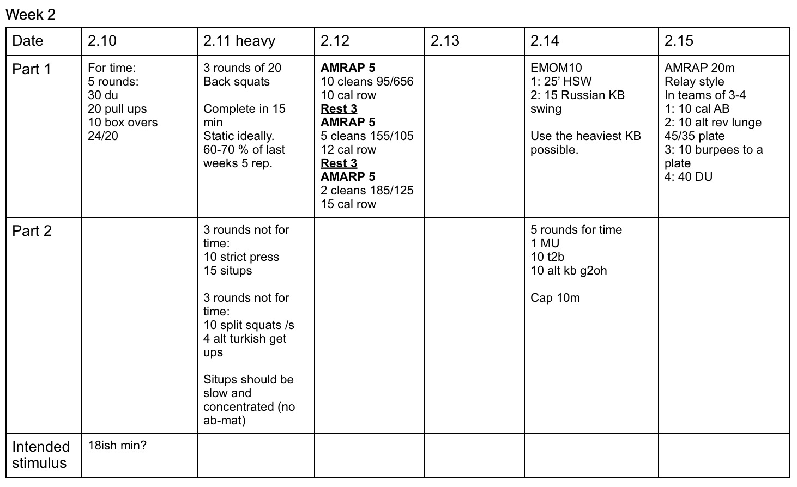

*  ### 2/10/20
    Nothing complicated.
* ### 2/11/20
    Strength: I'd prefer to see this as static weight.  But, I know it's going to be hard at 20 reps.  
    Strength 2: Sit-ups should be slow and concentrated. No abmat.  All other weight is AHAP.  
* ### 2/12/20
    Score rounds and reps.  Start each metcon from the begining and just add all extra reps at the end. 
* ### 2/14/20 
    Strength: If the 70lb kb isn't heavy enough, feel free to use 2x53's.  
    Metcon: I think it's pretty clear. 
* ### 2/15/20
    Relay style.  A new round doesn't start until last person in group is done with last exercise.  