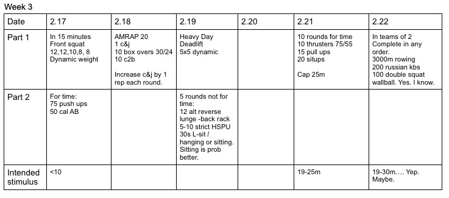

*  ### 2/17/20
    Strength: Post the final set of 8. Metcon: Sprint.  
* ### 2/18/20
    Clean and Jerk weight is Body weight / 70% of body weight. Each round, increase the c&j reps by 1. Scale weight to a managable, safe weight. 
* ### 2/19/20
    Strength: AHAP. Strength part 2: Reverse lunge can be from the rack. 
* ### 2/21/20 
    Wear grips.  
* ### 2/22/20
    Divide reps however.  *Double squat wallball* NOT while the ball is in the air.  Squat twice and toss the ball on the second squat. 