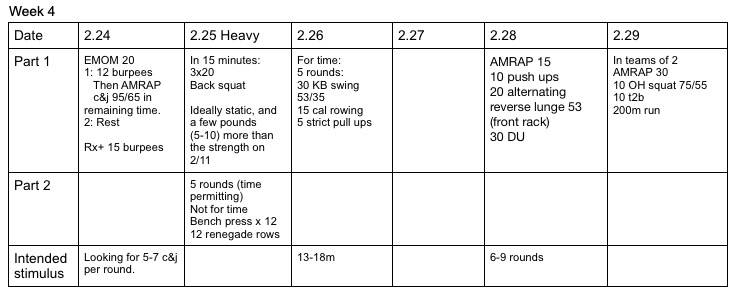

*  ### 2/24/20
    Each working minute should be a sprint. Rest / puke even minutes. Note: some of the recent Rx+ options are to encourage harder metabolic options, not just heavier or more complicated/technical. 
* ### 2/25/20
    I think everything is pretty clear for this heavy day. 
    [Dave Tate on Benchpress](https://www.t-nation.com/workouts/6-week-bench-press-cure)
    Anything Dave Tate says about benchpress or squat is bascially 100%.  If you watch the videos, just be aware his vocabulary is about like mine.... There's also a wealth of information from him online. 
* ### 2/26/20
    Pretty clear and simple.  Just keep an eye on legit strict pull ups. 
* ### 2/28/20 
    Hold the kb with both hands in the front rack, under the chin. *Can hold the bell or the handle.  The important part is tucked under the chin.  
* ### 2/29/20
    Pretty clear. 