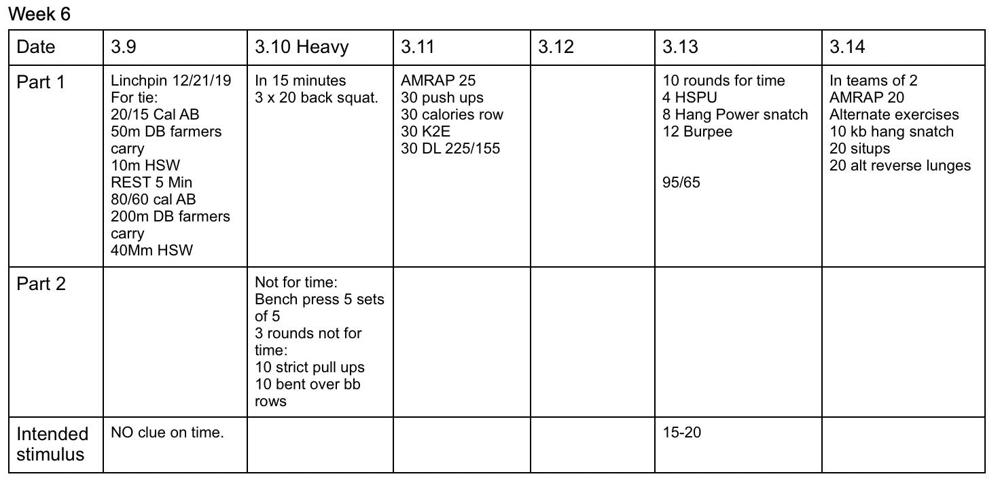

*  ### 3/9/20
    For Time.. typo.  Linchpin wod.  Looked different. Score total time. 50/35.  Could use KB's too. 
* ### 3/10/20
    Strength: Looking to be a little heavier than the last 3x20.  Maybe 5lbs heavier. 
    Strength 2: Bench is by it self.  Then superset pull ups and rows. 
* ### 3/11/20
    Deadlift weight should be a weight athletes can safely TnG 10 reps.
* ### 3/13/20 
    Pretty clear I think.  Time frame is a total guess and I suspect the spread will be wide.   
* ### 3/14/20
    Snatch can be 5/5 or switch arms each round. Lunges are not weighted. 