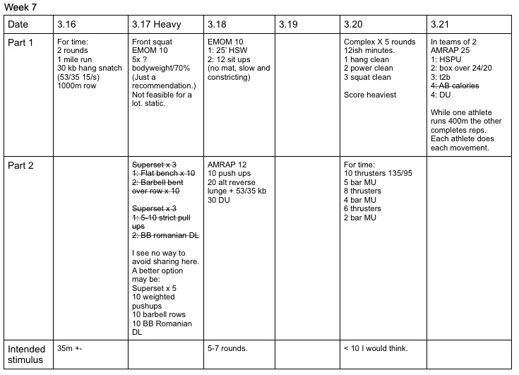

## I'm going to try my best to modify wods so there's less equipment sharing.  It's not easy.  As a coach, if you see an opportunity to modify that I've missed, by all means make that adjustment. 
*  ### 3/16/20
    pretty clear.  Another long one. 
* ### 3/17/20
    Strength 1: I've modified this one.  I feel like even sharing on the front squat is possible.  Wipe down shared bars and avoid licking each other. 
    Strength 2: If there's a way to do the part I marked through, awesome. Otherwise, plop a plate on your back and do pushups. Each should have minimal rest between. And don't lick each other.
* ### 3/18/20
    Strength/skill: I think it's clear. Metcon: Yes I know the pushups conflict with yesterday. The lunge will be the focus. 
* ### 3/20/20 
    Complex: looking for a little metabolic element in this. This is touch and go. Metcon: will suck. 
* ### 3/21/20
    Took AB out.  The way this is intended to work: Athlete 1 runs 400, A2 does HSPU reps, then A1 does reps and A2 runs, then box over,...... Score total reps.