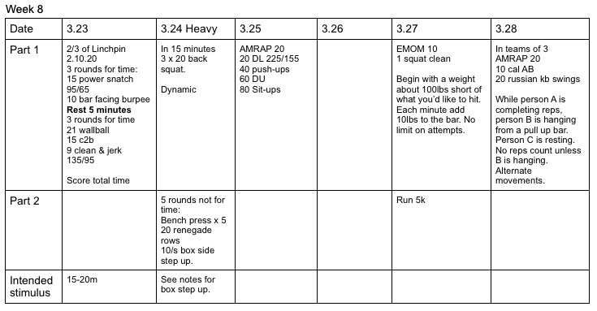

## Have not modified any of these for the Kung Flu yet. We'll just have to see.
*  ### 3/23/20
    Obviously a Linchpin wod.  Should be clear. Clearly terrible.
* ### 3/24/20
    Strength 1: clear. Strength 2: For the box step ups, standing with one side to the box - put one foot on top.  Try not to push off with the grounded foot.  It's hard not to though.
* ### 3/25/20
    Deadlift weight should be a weight athletes can safely TnG 10 reps.
* ### 3/27/20 
    Strength: Pick a starting weight about 90 pounds less than your current PR.  The goal is to PR. Add 10lbs per round.  (10 is just a suggestion, a lot will need to add 5 to avoid starting with negative weight lol.) 
* ### 3/28/20
    A, B, C.  A is repping. B is hanging. C is resting. Might have to modify for germs.  I dunno.  Don't lick each other. 