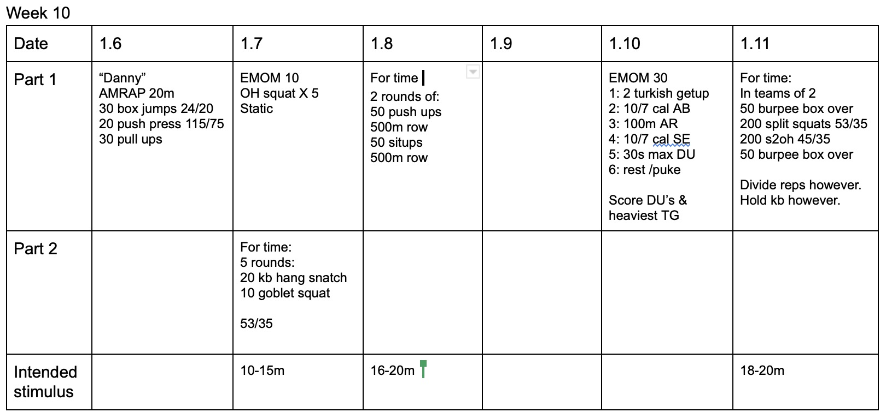

*  ### 1/6/20
    Pretty clear I think.  Lots of volume..
* ### 1/7/20
    Strength is static.  Maybe 55-60% or 1rm? Choose a safe weight. Metcon: Shoot for unbroken squats. 
* ### 1/8/20
    Compare to 12/24. Same exact number of reps as everything else.  Just without the 100 push up wall at the end. 
* ### 1/10/20
    This can have two scores or just one.  DU score is the one I'm interested in.  Turkish getups should be AHAP. 
    Everything else should be max effort.  For athletes who can't finish AB/AirRunner/Ski Erg in less than 45 seconds, scale it back.  For the getups, I'd prefer them be light enough to focus on good safe form instead of trying to fly through the motions. 
* ### 1/11/20
    This sucks.  FYI the wall is at 125 s2oh reps. 