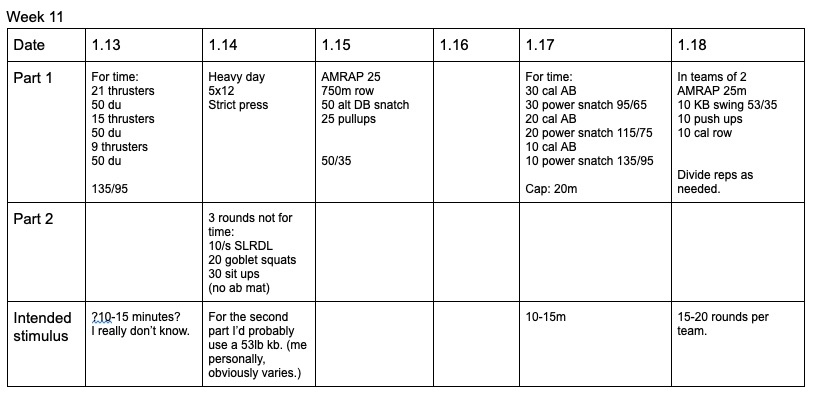

*  ### 1/13/20
    First and second round of thrusters shouldn't really be unbroken.  Maybe even sets of 5.  I'd use spare class time to do a gymnastics progression.  Probably not HSPU due to strict press tomorrow. 
* ### 1/14/20
    Strict press is dynamic. Beware of how fast shoulders fail. Err on the side of lighter. Lets just get SLRDL right. Remember, the hand holding the weight is opposite to the foot on the ground. Example: if I'm standing on my left leg (right leg back), I'm holding the weight in my right hand. This helps prevent opening the hips up so much. Situps are intentionally done with no abmat.  Less speed, more contraction.  This will probably be the hardest part for most.  
* ### 1/15/20
    Pretty clear I think. 
* ### 1/17/20
    Again, clear.  Looks innocent. It's far from it. Consider scaling back the weights if the athlete can't link at least a few TNG reps with the heaviest weight.
* ### 1/18/20
    Nothing complicated. 