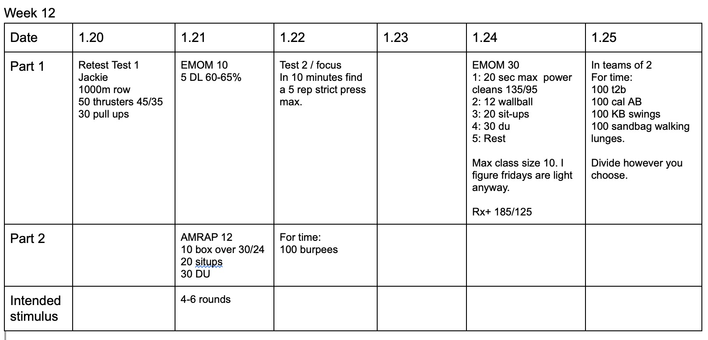

*  ### 1/20/20
    Jackie re-test.  Not much to put here. I expect to see some solid PR's.
* ### 1/21/20
    Again pretty straight forward.  Keep an eye on DL form.  Bar path is the biggest fault I see.  The bar floating away from the body is one of the biggest factors for back pain. Bloody shins wins.  
* ### 1/22/20
    Test 2.  Very clear. Burpees... looking for 6-10. 5 is FAST but possible. 10 is slow and fail. 
* ### 1/24/20
    Modified from the original due to equipment I had involved.  Ignore the max class size part. This should really emphasize that clean and jerk.  
* ### 1/25/20
    I have absolutely no idea how long this will take. I'd guess 15-20 minutes.  