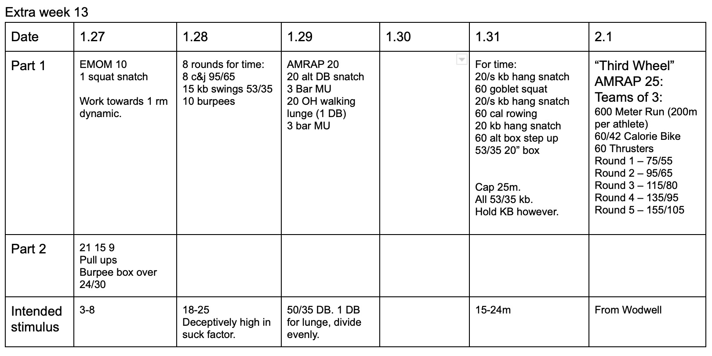

* ## This is an extra week.  Post re-test and prior to another cycle begining. I'm going to be putting these in after each 3 month cycle. 
*  ### 1/27/20
    I think it's pretty clear. Looking for technique more than anything on the snatch. 
* ### 1/28/20
    This gets tough.  Tested. I stayed unbroken on everything and was still mid 19m. That said, strategic rest could be faster. 
* ### 1/29/20
    Alternating on the snatch. Even reps on the lunge.
* ### 1/31/20
    Step ups are with the kb.  It can be held any way you want.  Squats are held at the chest though.
* ### 2/1/20
    Borrowed from the internets.... no clue what to expect. 