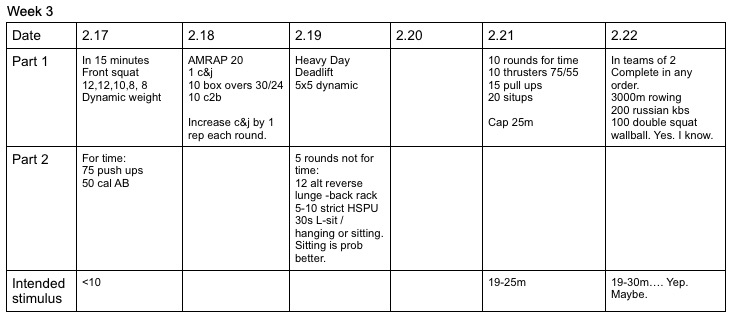

*  ### 11/18/19
    The feedback was so good on this one, I had to revisit it.
* ### 11/19/19 
    Very clear. Yes I know there's two days of AB in a row. Sorry. 
* ### 11/20/19
    This is stupid hard. Might want to cap it at 40m? For those that think 95/65 is too light, they're wrong.
* ### 11/22/19 
    Clear with some skill work to follow.
* ### 11/23/19
    Depending on numbers and equipment, half teams can start with AB, half with row.  Just alternate.  As long as more than one round is completed, it will even out. 
