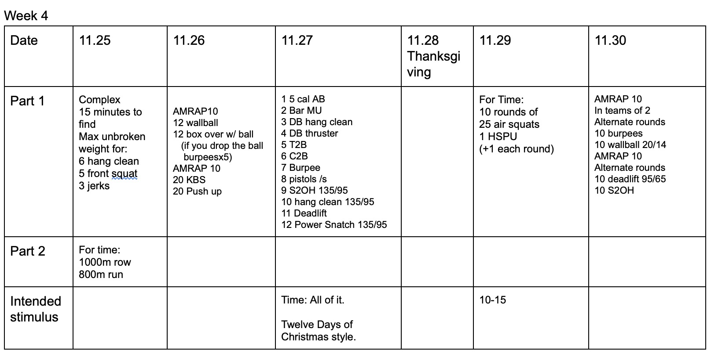

*  ### 11/25/19
    Rest as needed for the strength.  Keep weights safe. Metcon should be straight forward.
* ### 11/26/19 
    Just a note, this wod showed up at Postal recently.  We're not copying them. That's all that needs to be said. 
    Metcon: two amraps with no break in between.  On the first one, you can't drop the ball.  (or squat and prop it on your legs).  If the ball gets dropped, 5 burpee penalty.  
* ### 11/27/19
    This is 12 days of christmas style.  It will take > 40 minutes.  DB weights are 50/35 x 2. There should be enogh separation that it works out fine.  If not, it's just a workout. Just wait a few seconds.  I think most of the movments are clear.  The format is: 1 x 5 cal AB, 2 bar MU - 1 AB, 3 DB hang clean - 2 bar mu - 1 AB.  All the way until the end.  Scale weights and movments as needed.  
* ### 11/29/19 
    Air squats stay static. HSPU increase by one per round.  Times will be very spread out. 
* ### 11/30/19
    I think it's pretty clear.  There will be a lot of waiting around, but there will be enough suck too.  