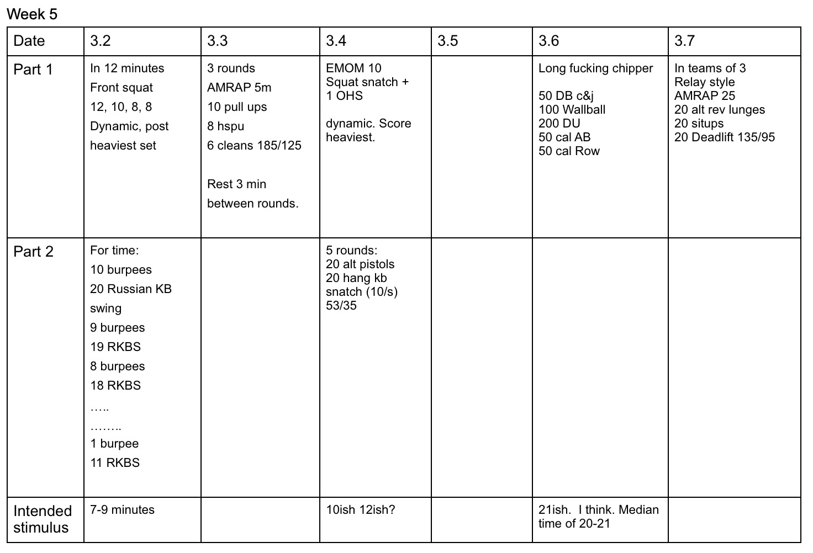

*  ### 12/2/19
    This is a tough wod.  The s2oh hits you hard and fast.  3 rounds is great. 
* ### 12/3/19 
    Strength: Go as heavy as you can for the emom. Weight is dynamic.  Watch arching of the back.
    Metcon: Rest built in just to make things worse.  Enjoy. 
* ### 12/4/19
    As always keep an eye on pushup form.  Also, lets pay particular attention to walking lunges.  I've noticed a trend of not standing up entirely (full hip extention).  Lets make sure everyone is finishing their reps. 
* ### 12/6/19 
    Figuring out the appropriate weight for this one is going to be difficult.  As noted, if the althlete can do 10+ with the rx weight, they need to be Rx+.  If the athlete doesn't have 5 with whatever weight they've choosen, then scale down to a more manageble weight.  This should be a sub 10 minute wod.  In all reality, I'd like to see it sub 5.  
* ### 12/7/19
    I think it's clear, divide all reps however you choose.  40 total cals on buy in and cash out, not each.  