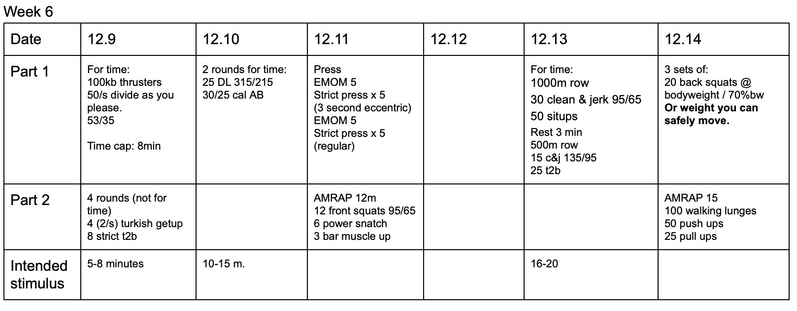

*  ### 12/9/19
    Look for times 5-7ish on this.  Maybe let athletes know they can adjust their reps from a "hip" driven press to a shoulder press.  This seems to move the focus from the quads to the shoulders and helps you keep moving.
* ### 12/10/19
    If athletes can't touch and go with Rx weight for 5 reps with excellent form, they should probably scale.  I think this is an excellent workout, but the potential for injury is certainly there.  
* ### 12/11/19
    I think the strength is clear. Just to be clear, I'm looking for a 3 second negative on the first emom. Weight should be static, but I'm guessing most are going to struggle to find the appropriate weight.  No rest between emoms.  
* ### 12/13/19
    This one has been tested.  It's a pretty crushing. 
* ### 12/14/19
    Most of this is clear, try to keep the strength to arounbd 15 minutes if possible. 
