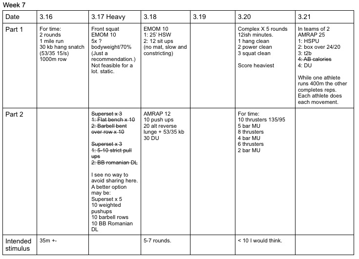

*  ### 12/16/19
    Just remember proper KB front rack. Fist under the chin, elbow tucked.  
* ### 12/17/19 
    Times are going to be really spread out on this one.  Capped at 35m
* ### 12/18/19
    Tested.  It's possible to finish, but not likely.  At least not with legit reps.
* ### 12/20/19 
    I think this is clear. 
* ### 12/21/19
    The shoulder to overhead doesn't seem so bad.  It is. 