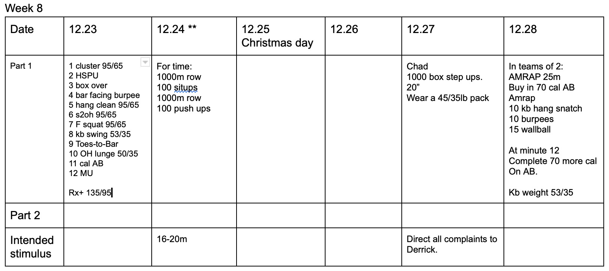

*  ### 12/23/19
    Lunge is a single DB. I think this should be easier than the last one on thanksgiving.  Time cap is up to coach.  I doubt anyone is finishing this sub 45 minutes though.  These things are always really hard to tell. Weights are light, I feel like it should move fairly quickly.  Not sure anyone really needs to Rx+.
* ### 12/24/19 
    This feels like you're screaming through it. Until the pushups.. Pushups are 40% of the wod. There's two movements that we should spend time correcting. Both pushups and situps. 
* ### 12/27/19
    All I can say is blame Lail. I recently did 200 stepups with a 35lb kb.  That took me 12 minutes unbroken. If I'm remembering correctly, pros were taking an hour or so for this. 
* ### 12/28/19 
    Pretty clear, divide all work as needed. 
