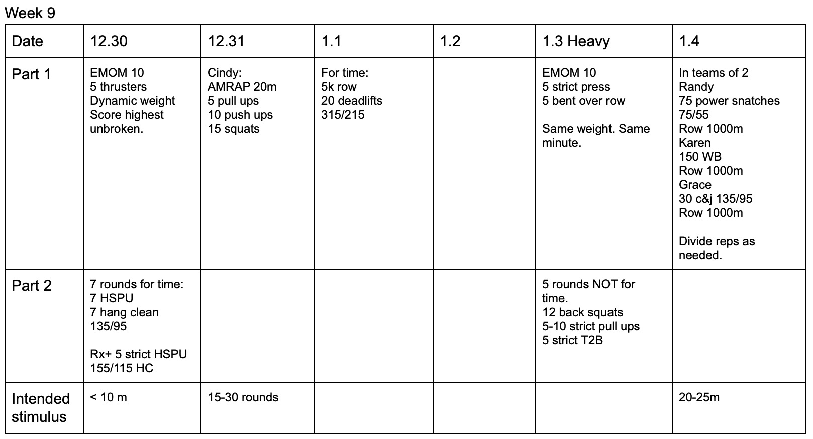

*  ### 12/30/19
    Strength is dynamic. Don't get hurt.. Metcon will be spread out, mostly due to HSPU.
* ### 12/31/19 
    We all know Cindy. 
* ### 1/1/20 wow
    21-24 minutes for males? 22-25 female? I think these are great wods, but they do make me nervous.  Weight should be scaled if athlete isn't able to touch and go with Rx weight for at least 5 reps.
* ### 1/3/20 
    Heavy day.  Not sure about how the weight will workout on the back squats. All weights are dynamic.
* ### 1/4/20
    Pretty clear.  Cap decided by coach. 